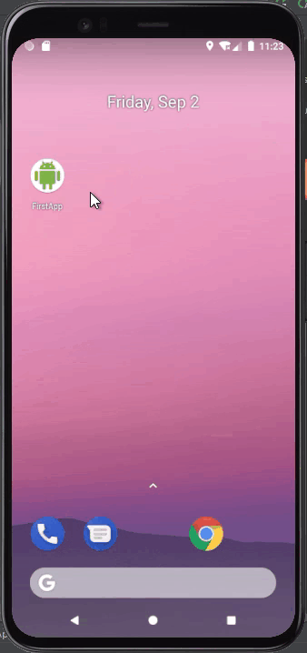

# FirstApp

A simple app that doubles the displayed number each time a user taps the floating action button.

When a user taps the floating action button, the displayed value doubles and a snackbar appears at the bottom of the screen showing the old value and the new value.

